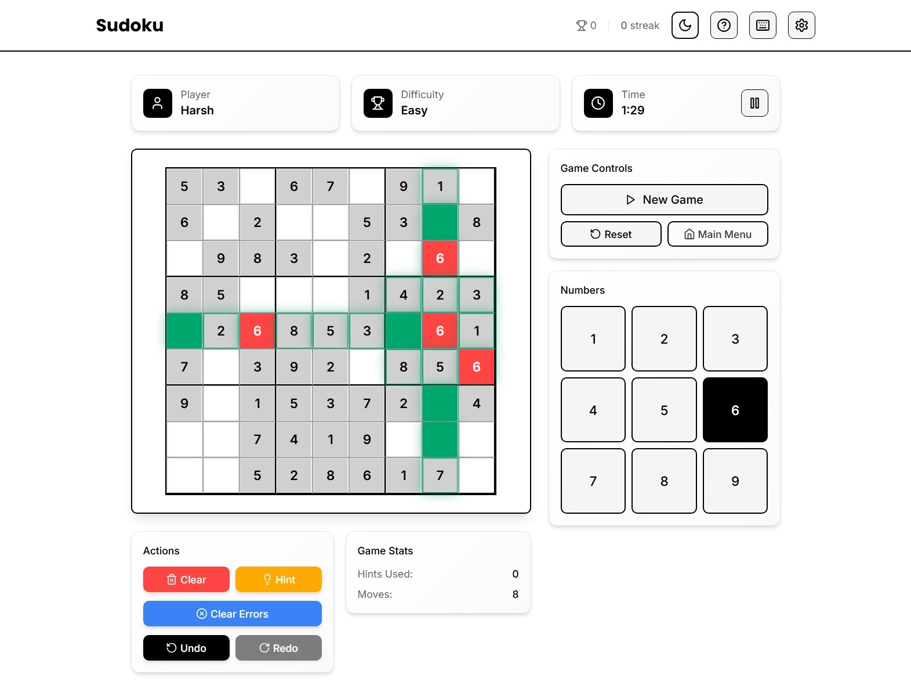
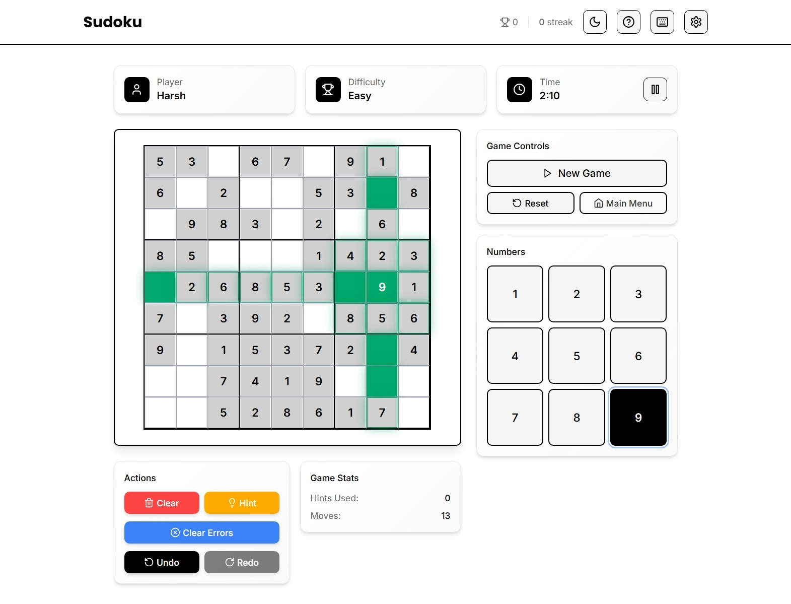
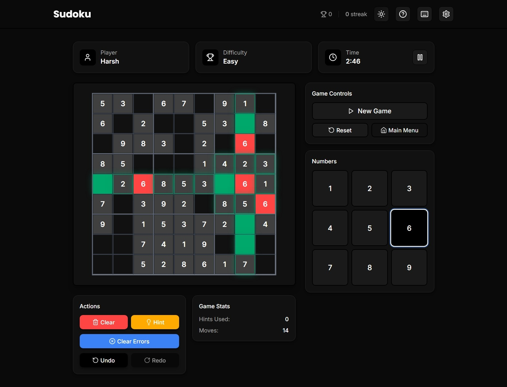
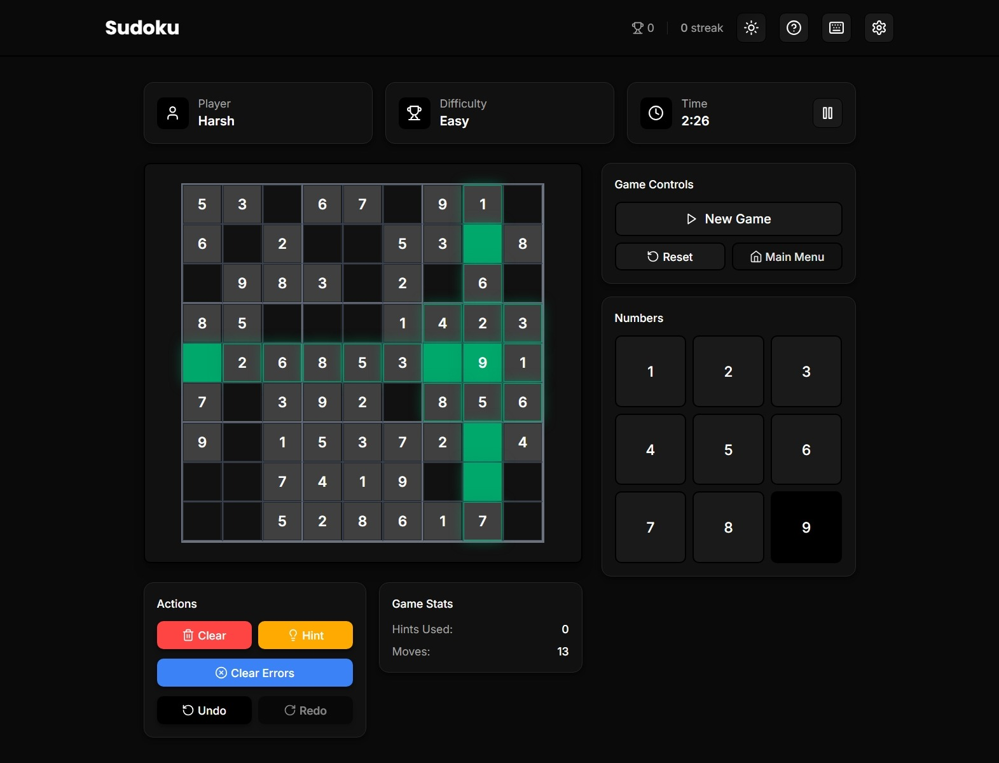

# Modern Sudoku Game 🧩

A beautiful, modern Sudoku game built with React, TypeScript, and Tailwind CSS. Features smooth animations, responsive design, and a delightful user experience with a clean blue color scheme.

## 📸 Screenshots

### Light Theme
<div align="center">
  
  
</div>

### Dark Theme
<div align="center">
  
  
</div>

## ✨ Features

### 🎮 Game Features
- **6 Difficulty Levels**: Easy, Medium, Hard, Expert, Master, and Legendary
- **Smart Hints System**: Get help when you're stuck
- **Undo/Redo**: Never lose your progress
- **Real-time Validation**: Instant feedback on mistakes with red error highlighting
- **Timer**: Track your solving time
- **Statistics**: Track your performance and streaks
- **Achievements**: Unlock rewards for milestones
- **Keyboard Support**: Full keyboard navigation and number input
- **Clear Errors**: One-click error clearing functionality

### 🎨 Modern UI/UX
- **Responsive Design**: Perfect on desktop, tablet, and mobile
- **Dark/Light Theme**: Automatic system theme detection with blue accent colors
- **Smooth Animations**: Powered by Framer Motion
- **Beautiful Typography**: Inter font family
- **Accessible**: Full keyboard navigation and screen reader support
- **Clean Design**: Modern blue color scheme with excellent contrast
- **Grid Separation**: Clear visual separation between 3x3 Sudoku boxes

### 🚀 Technical Features
- **PWA Ready**: Install as a mobile app
- **Offline Play**: Works without internet connection
- **Auto-save**: Never lose your progress
- **TypeScript**: Full type safety
- **Modern React**: Hooks, Context, and functional components
- **State Management**: Zustand for efficient state handling
- **Conflict Detection**: Smart algorithm to identify and highlight conflicts

## 🛠️ Tech Stack

- **Frontend**: React 18, TypeScript
- **Styling**: Tailwind CSS
- **Animations**: Framer Motion
- **State Management**: Zustand
- **Build Tool**: Vite
- **Testing**: Vitest, React Testing Library
- **PWA**: Vite PWA Plugin

## 🚀 Getting Started

### Prerequisites
- Node.js 18+ 
- npm or yarn

### Installation

1. **Clone the repository**
   ```bash
   git clone <repository-url>
   cd sudoku-game-modern
   ```

2. **Install dependencies**
   ```bash
   npm install
   ```

3. **Start development server**
   ```bash
   npm run dev
   ```

4. **Open your browser**
   Navigate to `http://localhost:5173` (or the port shown in terminal)

### Available Scripts

- `npm run dev` - Start development server
- `npm run build` - Build for production
- `npm run preview` - Preview production build
- `npm run test` - Run tests
- `npm run test:ui` - Run tests with UI
- `npm run lint` - Run ESLint
- `npm run lint:fix` - Fix ESLint errors

## 🎯 How to Play

1. **Start a New Game**: Choose your difficulty and enter your name
2. **Fill the Grid**: Click on empty cells and use the number pad or keyboard to enter numbers
3. **Use Hints**: Click the hint button when you need help
4. **Track Progress**: Monitor your time and statistics
5. **Complete the Puzzle**: Fill all cells correctly to win!

### 🎹 Keyboard Shortcuts
- **Numbers 1-9**: Enter numbers in selected cell
- **Arrow Keys**: Navigate between cells
- **Delete/Backspace**: Clear selected cell
- **U**: Undo last move
- **R**: Redo move
- **H**: Get hint
- **Space**: Pause/Resume game

## 🎨 Game Interface

### Main Components
- **Sudoku Grid**: 9x9 grid with clear 3x3 box separation
- **Number Pad**: Click numbers or use keyboard
- **Game Info**: Player, difficulty, timer, and pause button
- **Game Controls**: New game, reset, settings, main menu
- **Actions Panel**: Clear, hint, clear errors, undo, redo
- **Statistics**: Hints used, moves count

### Visual States
- **Selected Cell**: Blue background with white text
- **Highlighted Cells**: Light blue background for related cells
- **Error Cells**: Red background for conflicting numbers
- **Hint Cells**: Yellow background for hint numbers
- **Filled Cells**: Light blue background for original numbers

## 🏆 Achievements

- **First Victory**: Complete your first puzzle
- **Speed Demon**: Solve a puzzle in under 5 minutes
- **Perfectionist**: Complete a puzzle without mistakes
- **Streak Master**: Win 10 games in a row
- **Hint Hater**: Complete 5 puzzles without hints
- **Legendary Player**: Complete a Legendary difficulty puzzle

## 📱 PWA Features

This app can be installed as a Progressive Web App (PWA):

1. **Desktop**: Look for the install button in your browser
2. **Mobile**: Add to home screen from your browser menu
3. **Offline**: Play without internet connection
4. **App-like**: Full-screen experience with native feel

## 🎨 Design Philosophy

The app features a clean, modern design with:
- **Blue Color Scheme**: Professional and easy on the eyes
- **High Contrast**: Excellent readability in both light and dark modes
- **Consistent Spacing**: Proper margins and padding throughout
- **Smooth Transitions**: Elegant animations for better UX
- **Responsive Layout**: Adapts perfectly to all screen sizes

## 🧪 Testing

Run the test suite:

```bash
# Run all tests
npm run test

# Run tests with UI
npm run test:ui

# Run tests in watch mode
npm run test -- --watch
```

## 📦 Building for Production

```bash
# Build the app
npm run build

# Preview the build
npm run preview
```

The built files will be in the `dist` directory, ready for deployment.

## 🚀 Deployment

The app can be deployed to any static hosting service:

- **Vercel**: Connect your GitHub repository
- **Netlify**: Drag and drop the `dist` folder
- **GitHub Pages**: Use GitHub Actions
- **Firebase Hosting**: Use Firebase CLI

## 🤝 Contributing

1. Fork the repository
2. Create a feature branch (`git checkout -b feature/amazing-feature`)
3. Commit your changes (`git commit -m 'Add amazing feature'`)
4. Push to the branch (`git push origin feature/amazing-feature`)
5. Open a Pull Request

## 📄 License

This project is licensed under the MIT License - see the [LICENSE](LICENSE) file for details.

## 🙏 Acknowledgments

- **Original Sudoku Logic**: Based on classic Sudoku solving algorithms
- **UI Inspiration**: Modern design patterns and best practices
- **Icons**: Lucide React icon library
- **Fonts**: Google Fonts (Inter)

## 📞 Support

If you encounter any issues or have questions:

1. Check the [Issues](https://github.com/your-repo/issues) page
2. Create a new issue with detailed information
3. Contact the maintainers

---

**Enjoy playing Sudoku! 🧩✨**